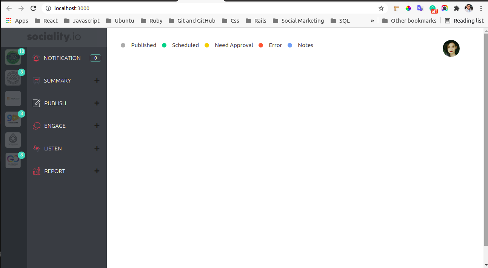
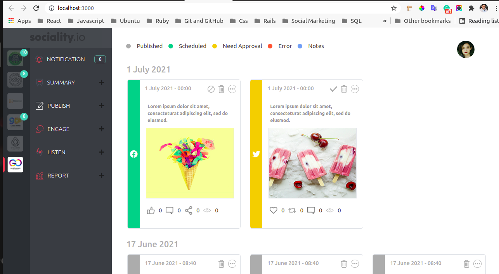
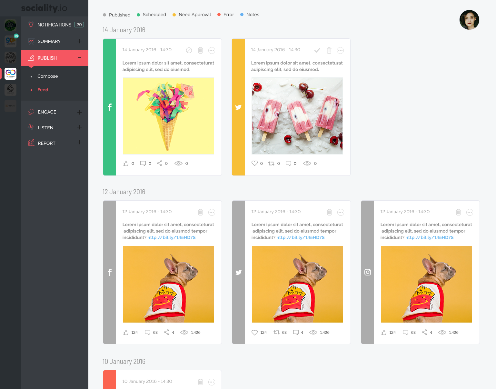
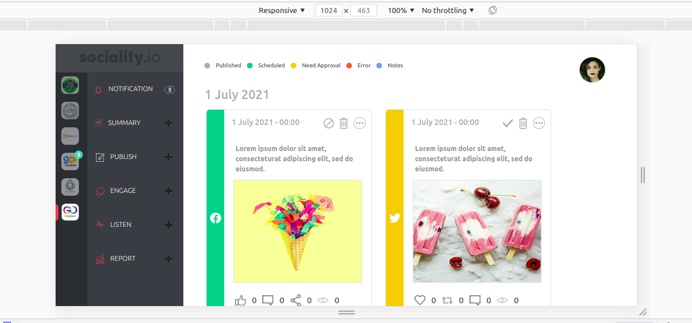
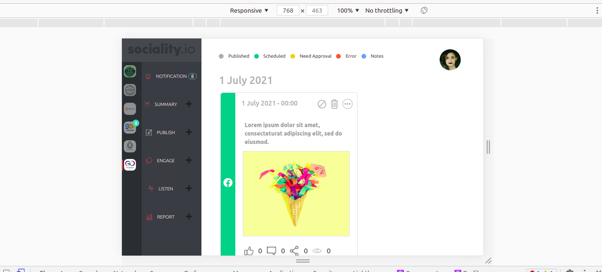

# Sociality Task:
 
> This is a task for a junior Front-end application from Sociality.io. This is a dashboard for managing social media marketing for clients.

# In this application:
- The dashboard has a sidebar including the brand switching tab and an accordion menu and has the content area including the social media posts.
- Each client has a tab with its logo with the number of notifications.
- When the user clicks on the tab, the client posts will appear in the content area.
- The posts cards contains information about:
    1. Status of the post.
    2. Icons related to the status.
    3. Icons related to the social media platform.
    4. Data of the post (Date of publish, body, image (if the image is not loaded it will be replaced by a default image)).
    5. Data related to the post engagement.
- Accordion menu with Buttons.
- Status bar shows the color scheme of each status.
- User logo.

# Entry screen:
 

# Rednering posts:
1. 
 

2.
 

# Notification number:
The notification of each tab will show on the specified place in the notification button.

 


## Built With
- React.
- JS.
- Bootstrap.
- CSS.

## Setup

## Setup

1. To run this project locally, please ensure you have npm installed.
2. Open the terminal.
3. Clone this repository by running:

```bash
git clone https://github.com/AhmedAmin90/sociality-react
```

4. To install the dependencies Open your terminal at the project folder: 

```bash
npm install
```

5. Start the server :

```bash
npm start
```

# Notes:
- I followed the design:

 
- I assume that this platform is working on laptops and tablets screen sizes, so I adjust the style for some important parts in the design according to these screen sizes, and it is not responsive for other sizes. 
1. Laptop:
 7
2. Tablet:
 


## Authors

**Ahmed Amin** 
- GitHub: [Profile](https://github.com/AhmedAmin90)
- LinkedIn: [Profile](https://www.linkedin.com/in/web-developer/)
- AngelList: [Profile](https://angel.co/u/ahmed-amin-22)
- Twitter: [Profile](https://twitter.com/AhmedAmin12383)
- Portfolio: [My Portfolio](https://amin-dev-me.netlify.app/)


## Contribute
Any advice and suggestion for improvement are more than welcome.
Visit [issues' section](https://github.com/AhmedAmin90/sociality-react/issues)

## Show your support
Give a star if you like this project!

## License
<p>This project is <a href="./LICENSE">MIT</a> licensed.</p>
